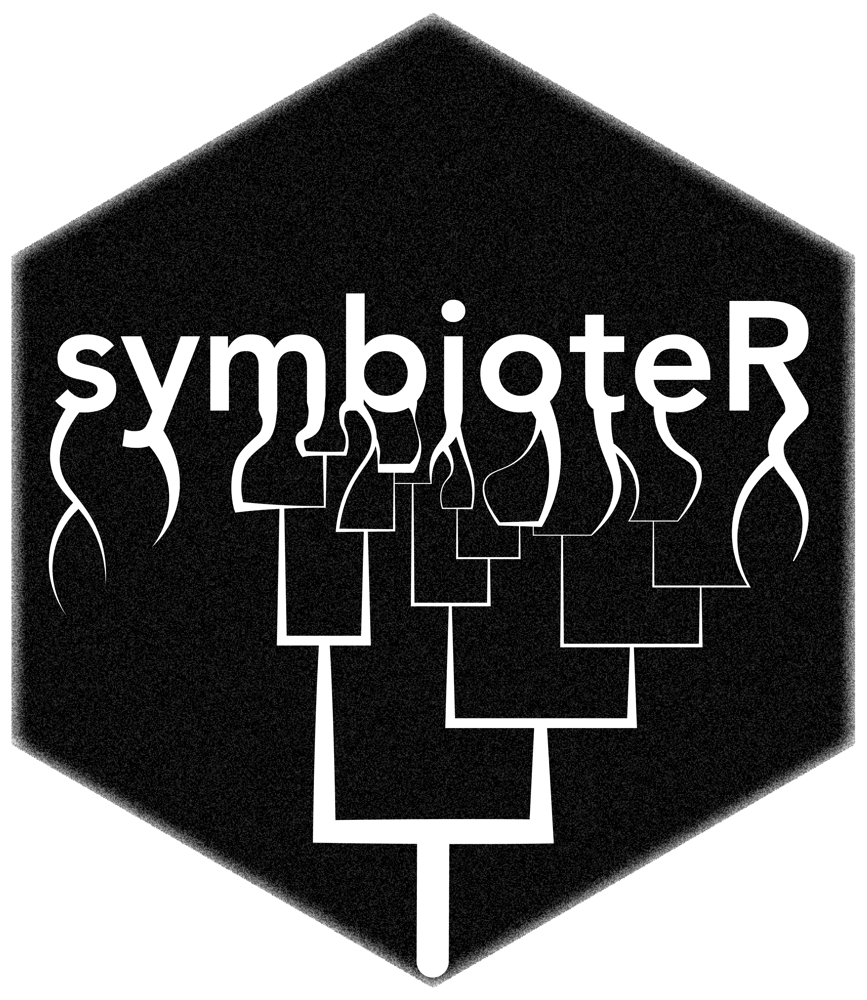

# symbioteR 

<!-- badges: start -->
[](https://github.com/B0ydT/symbioteR/actions/workflows/R-CMD-check.yaml)
[](https://lifecycle.r-lib.org/articles/stages.html#experimental)
[](https://github.com/B0ydT/symbioteR/blob/master/LICENSE)
<!-- badges: end -->

A set of simple but useful functions that I use frequently when working with 
`phyloseq` objects.

The package can be installed directly from GitHub.

```
install.packages("devtools")
devtools::install_github("B0ydT/symbioteR")
```
